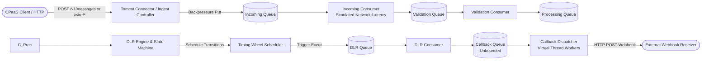

# RCS Simulator

[](https://openjdk.org/projects/jdk/21/)
[](https://spring.io/projects/spring-boot)
[](https://openjdk.org/jeps/444)
[](http://localhost:8080/swagger-ui.html)

A high-throughput, stateless mock telecom operator and RCS aggregator simulator designed for end-to-end integration and load testing of CPaaS (Communication Platform as a Service) platforms.

The simulator mimics real telecom carrier behavior—handling message ingestion, queueing, network submission, delivery receipts (DLRs), and webhook dispatch—without delivering to physical handsets or requiring external database/message broker dependencies.

---

## Key Features

- **Stateless & In-Memory:** No database, disk persistence, or external message broker required. Everything is held in memory for transient processing and evicted based on retention policies.
- **Extreme Throughput (10,000+ TPS):** Sized for high concurrency using Java 21 Virtual Threads (`Project Loom`), lock-free atomic rate limiters, and dedicated thread-per-task executors.
- **Zero-Loss Pipeline:** Bounded queues with backpressure for pipeline stages (`INCOMING`, `VALIDATION`, `PROCESSING`, `DLR`) combined with an unbounded `CALLBACK` queue so slow webhook receivers never block message ingestion.
- **Hierarchical Timing Wheel:** Custom $O(1)$ timer wheel (`TimingWheelScheduler`) replacing standard Java `ScheduledThreadPoolExecutor` for high-volume lifecycle delays and callback retries.
- **Dual Interface Modes:**
  - **Native API (`/v1/messages`):** Clean, dynamic JSON envelope.
  - **Real Provider Wire Emulation (`/wire/{provider}`):** Drop-in compatibility with real carrier wire protocols: **Jio**, **Dotgo**, **Vodafone Idea (Vi)**, and **Airtel**, including OAuth2 token mock endpoints.
- **Multi-Instance Callback Routing:** Dynamic path-based routing (`/{instance}/wire/{provider}/...`) supporting multiple CPaaS environments (`dev`, `staging`, `cerf`) from a single deployed instance.
- **Outbound Webhook Delivery:** Automatic DLR dispatch with configurable delays, error probabilities, retry with exponential backoff, and per-destination circuit breakers.
- **Media & Capability Services:** In-memory media upload and retrieval (`/v1/media`, `/media/{id}`) and deterministic RCS capability discovery (`/v1/capability/check`).

---

## Architecture & Concurrency Model



### Dedicated Virtual-Thread Executors Per Queue
Each queue stage (`INCOMING`, `VALIDATION`, `PROCESSING`, `DLR`, `CALLBACK`) is managed by `InMemoryQueueService` with its own dedicated virtual-thread executor (`Executors.newThreadPerTaskExecutor`). 
- Worker threads blocking on `take()`, `Thread.sleep()`, or outbound HTTP I/O unmount from OS carrier threads.
- Slow external webhook responses in the `CALLBACK` stage cannot starve processing threads in the ingestion or state machine stages.

### Capacity and the Zero-Loss Guarantee
- Stages up to `DLR` apply backpressure using blocking puts on bounded queues to prevent unbounded memory growth while guaranteeing no message drops.
- `CALLBACK` queue is intentionally unbounded to decouple external receiver latency from inbound API response time.
- If an external receiver fails or becomes slow, a per-destination circuit breaker (`CallbackCircuitBreaker`) trips after consecutive failures to protect outbound connection pools.

### Timing Wheel Scheduler
Instead of a single synchronized heap (`ScheduledThreadPoolExecutor`), delays for state transitions (`ACCEPTED` $\to$ `QUEUED` $\to$ `SUBMITTED` $\to$ `DELIVERED`) and callback retry backoffs are driven by `TimingWheelScheduler`:
- **Resolution:** Configurable tick (default 100ms).
- **Complexity:** $O(1)$ insert and expiration scheduling.
- **Workers:** Independent virtual-thread concurrency pool.

---

## Content Model & Message Ingestion

### Open & Dynamic Design
The simulator is intentionally unauthenticated and open:
1. Any caller is accepted; no API key, bot pre-registration, or client registration is required.
2. The `content` payload in `POST /v1/messages` is an opaque `JsonNode`. Any JSON structure (text, rich card, carousel, suggestions, media) is accepted as-is without validation and echoed back in DLR webhooks.
3. Fields like `agent_id`, `to`, `message_type`, and `content` are optional.

### Ingestion Contract: `POST /v1/messages`
```json
{
  "agent_id": "agent-001",
  "to": ["+919876543210"],
  "message_type": "text",
  "content": {
    "text": "Hello, RCS test message!"
  },
  "corelation_id": "corr-uuid-12345",
  "callback_url": "https://your-domain.com/webhook"
}
```

#### Response (`202 Accepted`):
```json
{
  "status": "ACCEPTED",
  "providerMessageId": "SIM4a7a9e0100000001",
  "correlationId": "corr-uuid-12345",
  "timestamp": "2026-09-18T16:15:00.000+05:30"
}
```

---

## Real Provider Wire Format Emulation

Configure your CPaaS provider adapter's `base_url` directly to the simulator without altering CPaaS code.

### 1. Jio Business Messaging
- **Base Path:** `/wire/jio` or `/{instance}/wire/jio`
- **Send Endpoint:** `POST /messaging/users/{to}/assistantMessages/async?messageId={messageId}&assistantId={assistantId}`
- **Token Endpoint:** `GET /v1/oauth/token` (Returns static token `simulator-client-token`)
- **DLR Webhook Format:** Jio-specific event payload matching captured carrier schema (`msg_status`, `message_id`).

### 2. Dotgo RBM
- **Base Path:** `/wire/dotgo` or `/{instance}/wire/dotgo`
- **Send Endpoints:**
  - Bot API: `POST /bot/v1/{botId}/messages`
  - Agent API: `POST /agentMessages`
- **Token Endpoint:** `POST /auth/oauth/token`
- **DLR Webhook Format:** Dotgo delivery event schema (`deliveryReceipt`, `messageId`, `eventTimestamp`).

### 3. Vodafone Idea (Vi)
- **Base Path:** `/wire/vi` or `/{instance}/wire/vi`
- **Send Endpoint:** `POST /messages`
- **Token Endpoint:** `POST /auth/oauth/token`
- **DLR Webhook Format:** Vi carrier status report payload.

### 4. Airtel
- **Base Path:** `/wire/airtel` or `/{instance}/wire/airtel`
- **Send Endpoint:** `POST /messages`
- **Authentication:** Direct HTTP Basic Auth on send endpoint.
- **DLR Webhook Format:** Airtel RCS delivery receipt envelope.

### Multi-Instance Routing
Deploy one simulator instance to serve multiple environments by prefixing the URL:
- `http://localhost:8080/dev/wire/jio/...` $\to$ Dispatches DLRs to `operator.instances.dev.profiles.jio.callback-url`
- `http://localhost:8080/staging/wire/vi/...` $\to$ Dispatches DLRs to `operator.instances.staging.profiles.vi.callback-url`
- `http://localhost:8080/cerf/wire/dotgo/...` $\to$ Dispatches DLRs to `operator.instances.cerf.profiles.dotgo.callback-url`

---

## Message Lifecycle & DLR Webhooks

### State Machine Transitions
Messages advance through states according to configurable delays:
```
ACCEPTED (0s) -> QUEUED (1s) -> SUBMITTED (2s) -> DELIVERED (3s) -> DISPLAYED (optional)
                                       \
                                        -> FAILED / EXPIRED / UNKNOWN
```

### Configurable Probabilities
- `operator.probability.delivered-percentage=100`: Percentage of submitted messages that reach `DELIVERED`.
- `operator.probability.displayed-percentage=0`: Percentage advancing to `DISPLAYED` (read receipt). Set to 0 by default.
- `operator.probability.failed-percentage=0`: Simulated random failure rate.

### Error Simulation
When a failure occurs, the simulator selects a weighted error code:
- `INVALID_PHONE` (weight 20)
- `NOT_RCS_USER` (weight 25)
- `DEVICE_OFFLINE` (weight 25)
- `NETWORK_FAILURE` (weight 15)
- `RATE_LIMIT` (weight 5)
- `SERVICE_UNAVAILABLE` (weight 5)

---

## API Summary

| Method | Endpoint | Description |
|---|---|---|
| `POST` | `/v1/messages` | Ingest single RCS message (returns `202 ACCEPTED`) |
| `GET` | `/v1/messages/{providerMessageId}` | Query current status and transition history |
| `POST` | `/v1/messages/bulk` | Ingest batch of messages (up to 1,000 per request) |
| `POST` | `/v1/media` | Upload media file (returns media URL, in-memory) |
| `GET` | `/media/{id}` | Stream uploaded media content |
| `POST` | `/v1/capability/check` | Deterministic RCS handset capability check |
| `POST` | `/admin/reset` | Clear all in-memory message and media stores |
| `GET` | `/health` | Simulator health status and identity |
| `GET` | `/metrics` | Real-time throughput, TPS, queue depth, and worker stats |
| `GET` | `/swagger-ui.html` | Interactive Swagger / OpenAPI documentation |

---

## Configuration Reference

Key properties in `application.properties`:

```properties
# Server & Virtual Threads
server.port=8080
server.tomcat.max-connections=10000
server.tomcat.accept-count=4000
spring.threads.virtual.enabled=true

# Throughput Limiter
operator.tps.enabled=false
operator.tps.limit=10000
operator.tps.window-millis=1000

# Queue Worker Concurrency (Dispatch Loops)
operator.queue.incoming-workers=2000
operator.queue.validation-workers=256
operator.queue.processing-workers=256
operator.queue.dlr-workers=512
operator.queue.callback-workers=750

# Timing Wheel Scheduler
operator.scheduler.tick-duration-millis=100
operator.scheduler.wheel-size=512
operator.scheduler.worker-count=256

# Outbound Callback Connection Pool & Circuit Breaker
operator.callback.max-total-connections=750
operator.callback.max-connections-per-route=750
operator.callback.circuit-breaker.enabled=true
operator.callback.circuit-breaker.failure-threshold=10
operator.callback.circuit-breaker.cool-down-millis=30000
operator.callback.retry.max-attempts=5

# In-Memory Retention (Minutes)
operator.message-store.retention-minutes=10
operator.media.retention-minutes=10
```

---

## Getting Started

### Prerequisites
- **Java 21** or later
- **Maven 3.9+**

### Building and Running

1. **Clone the repository:**
   ```bash
   git clone https://github.com/Navjot0/RCS-Simulator.git
   cd "RCS Simulator"
   ```

2. **Run Unit and Integration Tests:**
   ```bash
   mvn test
   ```

3. **Start the Application:**
   ```bash
   mvn spring-boot:run
   ```

4. **Verify Application Health:**
   ```bash
   curl http://localhost:8080/health
   ```

5. **Open Swagger UI:**
   Navigate to [http://localhost:8080/swagger-ui.html](http://localhost:8080/swagger-ui.html) in your browser.

---

## Quick Example: Send & Query

### 1. Send Message
```bash
curl -X POST http://localhost:8080/v1/messages \
  -H "Content-Type: application/json" \
  -d '{
    "agent_id": "test-bot",
    "to": ["+919876543210"],
    "message_type": "text",
    "content": { "text": "Testing RCS Simulator" },
    "callback_url": "https://webhook.site/your-id"
  }'
```

Response:
```json
{
  "status": "ACCEPTED",
  "providerMessageId": "SIM9821387612345",
  "timestamp": "2026-09-18T16:15:00.000+05:30"
}
```

### 2. Query Status
```bash
curl http://localhost:8080/v1/messages/SIM9821387612345
```

---

## License

Internal & testing use only. Developed for CPaaS integration and performance verification.
